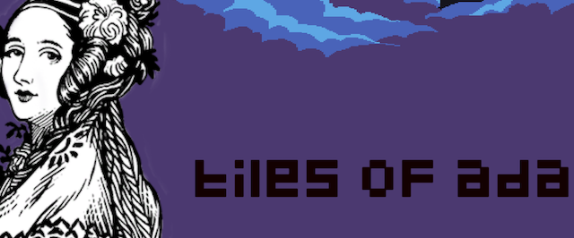
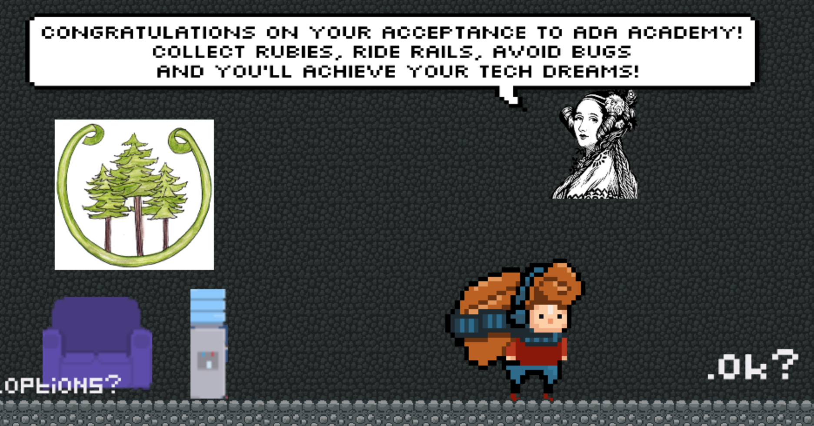
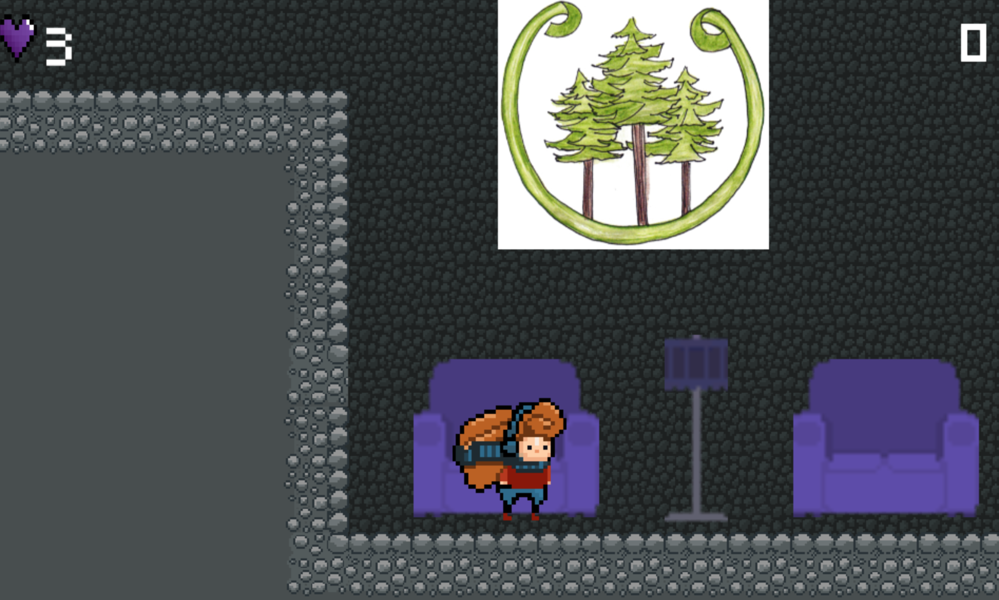

# TilesOfAda

A 2D platformer game with an Ada Academy theme made for Ada Developers Academy C10 Capstones! Collect gems and rubies, avoid bugs, ride rails, and make it through all three levels to win. Tiles of Ada is a browser-based game built using Unity 2018, with scripts written in C#. 

## How to Play
- Run: right arrow/left arrow
- Jump: space bar/up
- Complete level: jump into exit sign
- Ice blocks: player is unable to jump and is pushed right

## Screenshots

  
  
  
    
      
        
        
      

## Credits
