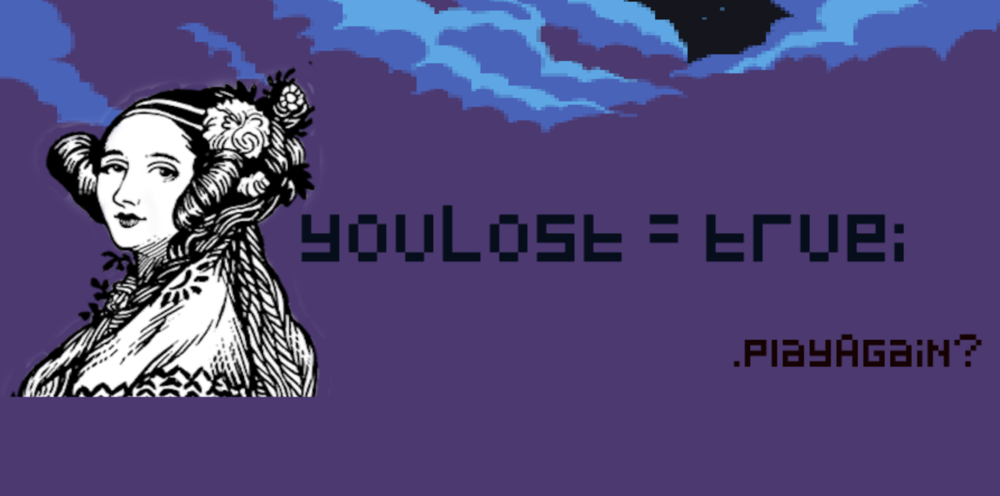

# TilesOfAda

A 2D platformer game with an Ada Academy theme made for Ada Developers Academy C10 Capstones! Collect gems and rubies, avoid bugs, ride rails, and make it through all three levels to win. Tiles of Ada is a browser-based game built using Unity 2018, with scripts written in C#. 

## How to Play
- Run: right arrow/left arrow
- Jump: space bar/up
- Complete level: jump into exit sign
- Ice blocks: player is unable to jump and is pushed right

## Credits
- Inspired and guided by tutorials on [Udemy](https://www.udemy.com) by [GameDev.tv](https://www.gamedev.tv/)
- Music by SketchyLogic on [OpenGameArt](https://opengameart.org/)
- Ada quotes by [brainyquote](https://www.brainyquote.com/)
- Pixel bubbles by [pixelspeechbubble](https://pixelspeechbubble.com/)
- Font by OmegaPC777 on [daFont](https://www.dafont.com/)
- Ada Photo from [ya-design](https://ya-webdesign.com/)
- Backgrounds by Zilo Media on [Unity](https://assetstore.unity.com/)
- Tile Map Assets by Marta Maksymiec on [Unity](https://assetstore.unity.com/)
- Generic Items by [Kenney](https://kenney.nl/)
- Classroom items by Mercyssh on [itch.io](https://itch.io/)
- Gems by qubodup on [OpenGameArt](https://opengameart.org/)
- Ada Logo by Liz Rush
- Winter Tiles by Marta Nowaczyk
- Hearts by Indiependent Fish on [Unity](https://assetstore.unity.com/)

## Screenshots

  
  
  
      

